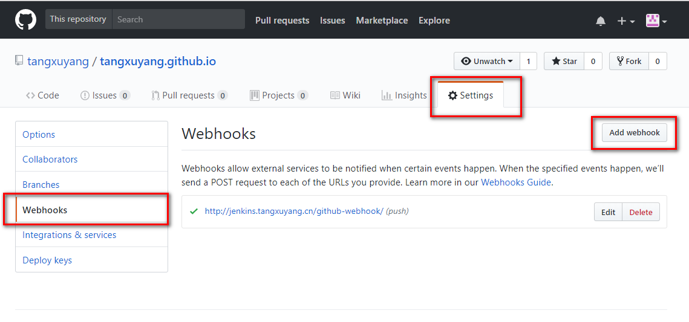
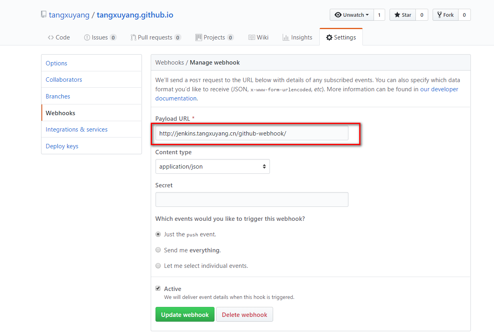

总结一下我是怎么把github pages同步到自己的服务器上的。  

先说一下思路，使用jenkins监听github提交，拉取代码到服务器，执行jekyll build，来编译jekyll项目。  

前提条件:
服务器上装了jenkins,jekyll

看还可以写几篇关于安装jenkins和jekyll的文章！  

github上的每个库在设置里面都有一个webhook的选项，只有打开这个选项，当代码提交时github才能通知到我们的jenkins服务。这里可以看出来，用的是推模式，而不是让jenkins轮巡的拉模式。还要配置jenkins的监听服务。  

然后就是在jenkins中创建一个新的项目了！我这里选择了自由风格的类型。  

  
